# DECKRUNNER

A wireframe capital-ship assault game for the browser, in the tradition of the 1983 Atari *Star Wars* cabinet. Fly the deck of enemy warships at altitude zero, knock out their shield generators, silence the launch bays, then drop into the trench and put a volley into the reactor port. Pull up before the end wall.

Seven waves. Six capital ships, then the starbase. Break its core and freedom survives.

**Play:** https://scottpeterman.github.io/deckrunner/

Everything is one self-contained HTML file: no build step, no dependencies, no network calls beyond an optional Google Fonts request. It runs from `file://`, from GitHub Pages, and on phones in portrait or landscape.

<p align="center">
  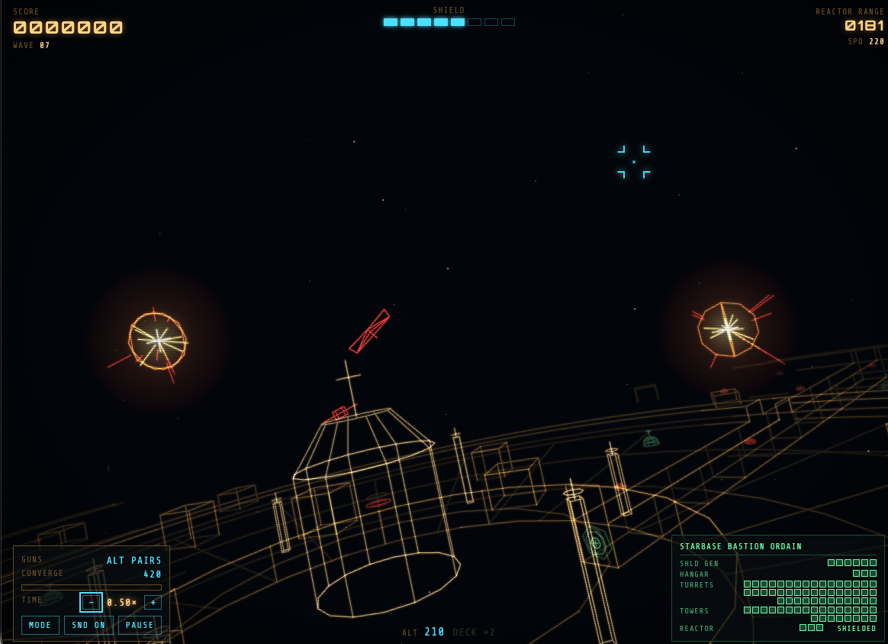
</p>

## The campaign

Each wave opens with a target briefing: hull dimensions, shield generators, launch bays, turret count, trench length, and how many fighters can be up at once.

<table>
  <tr>
    <td align="center">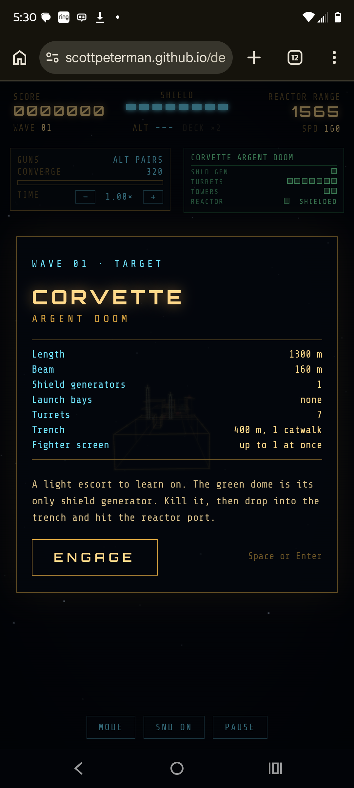<br><b>01 · Corvette</b><br>1300 m · 1 generator · no bays</td>
    <td align="center">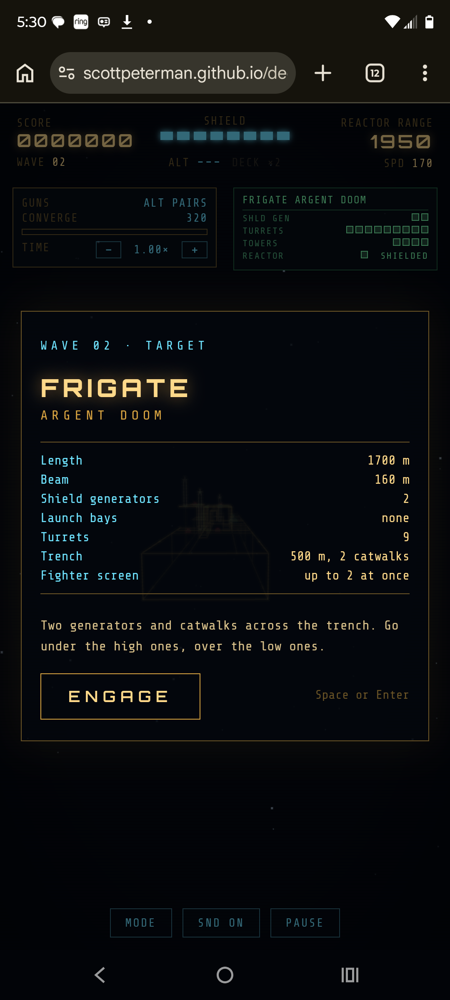<br><b>02 · Frigate</b><br>1700 m · 2 generators · catwalks</td>
    <td align="center">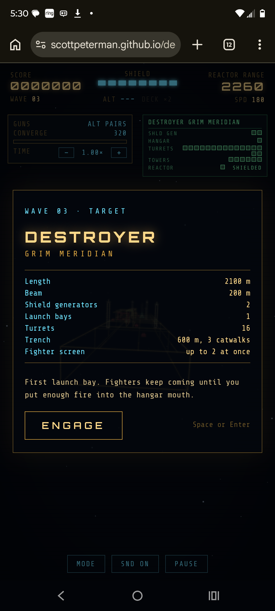<br><b>03 · Destroyer</b><br>2100 m · first launch bay</td>
  </tr>
  <tr>
    <td align="center">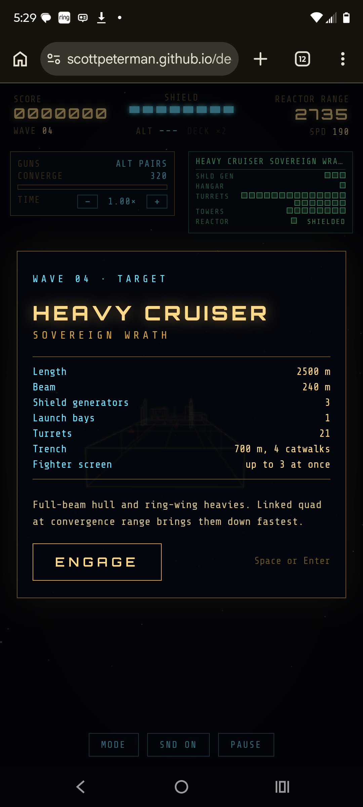<br><b>04 · Heavy Cruiser</b><br>2500 m · ring-wing heavies</td>
    <td align="center">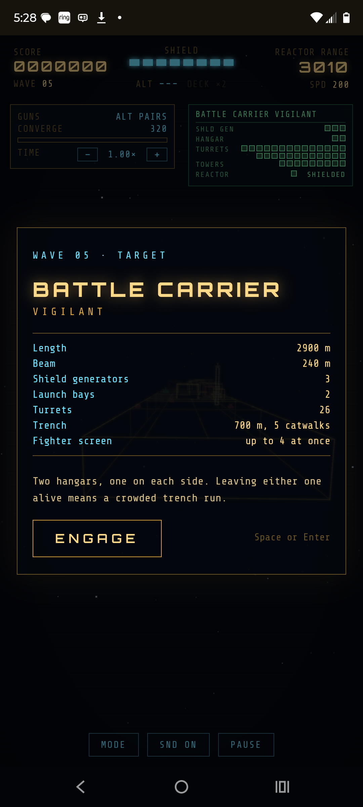<br><b>05 · Battle Carrier</b><br>2900 m · two hangars</td>
    <td align="center">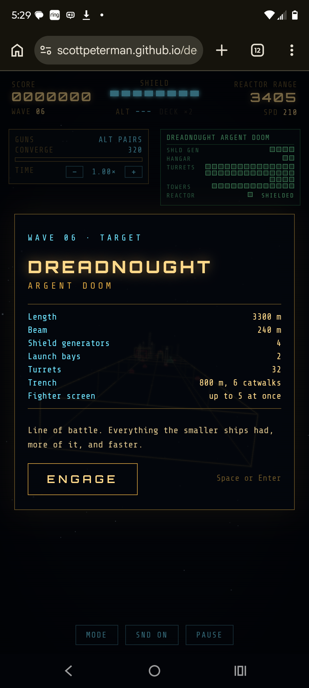<br><b>06 · Dreadnought</b><br>3300 m · 4 generators · 32 turrets</td>
  </tr>
  <tr>
    <td align="center" colspan="3">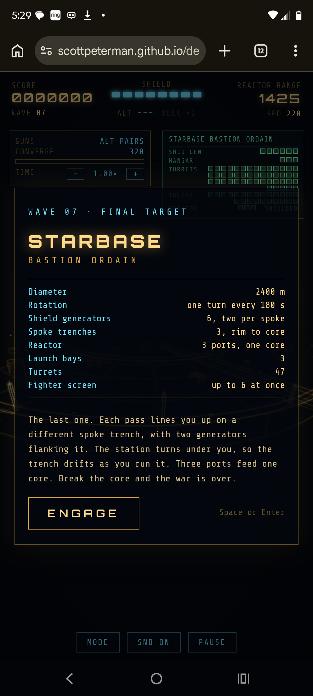<br><b>07 · Starbase — final target</b><br>2400 m rotating disc · 3 spoke trenches · 3 ports, one core</td>
  </tr>
</table>

Ship names are drawn at random each run; the class, layout rules and difficulty for each wave are fixed.

### The starbase

The last target is a 2.4 km disc that turns once every three minutes. Three radial trenches run from the rim to the hub, each ending in a reactor port, and all three ports feed one core. Two shield generators flank each spoke, so clearing the shields takes several passes. Each pass lines you up on the next spoke; the trench mouth is aligned as you cross the rim, then drifts as the station rotates under you, so you steer to stay in it all the way to the hub wall.

<p align="center">
  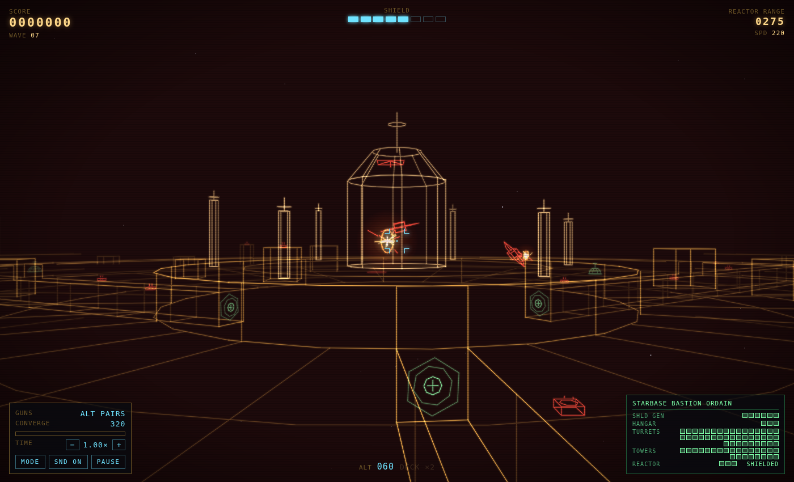
</p>

## Controls

| Input | Action |
|---|---|
| Mouse | Aim and steer. The ship flies toward the reticle. |
| Left button / Space | Fire |
| Right button / Q | Switch guns: alternating pairs ↔ linked quad |
| Wheel / `[` `]` | Gun convergence range (150–700) |
| Triple-tap / E / middle button | Energy burst: wide cone ahead, clears plasma, recharges (kills speed it up) |
| WASD / arrows | Keyboard aim |
| `−` / `=` / `0` | Game speed slower / faster / reset (down to 0.05×) |
| P · M · G | Pause · sound · glow |
| Touch | Drag to aim, hold to fire |

Below 22 altitude over the hull, everything scores double. Linked quad hits hardest when the target sits at your convergence range.

## Features

- **Procedural capital ships** built from a heightmap hull: superstructure, side trenches, towers, hangar blocks, and a main trench ending at the reactor wall. The starbase uses a separate polar-coordinate hull that rotates in real time.
- **Vector renderer** with depth-graded brightness, additive two-pass glow, and screen-space bloom on enemy plasma.
- **Four-gun convergence gunnery** with heat, two fire modes, and bolts that can intercept incoming fire.
- **Target damage readout** in the style of a ship systems display: every generator, bay, turret, tower and reactor port is a box that goes amber when hit and dark when destroyed.
- **Synthesized audio** (ZzFX core) through a mixer with a compressor, reverb send, stereo panning and distance falloff from each source's position, voice caps and pitch jitter.
- **Slow-motion control** for studying mechanics or taking screenshots. Audio pitches down slightly with it.
- **Portrait phone layout** that moves the instruments into the sky and keeps the deck clear.

<p align="center">
  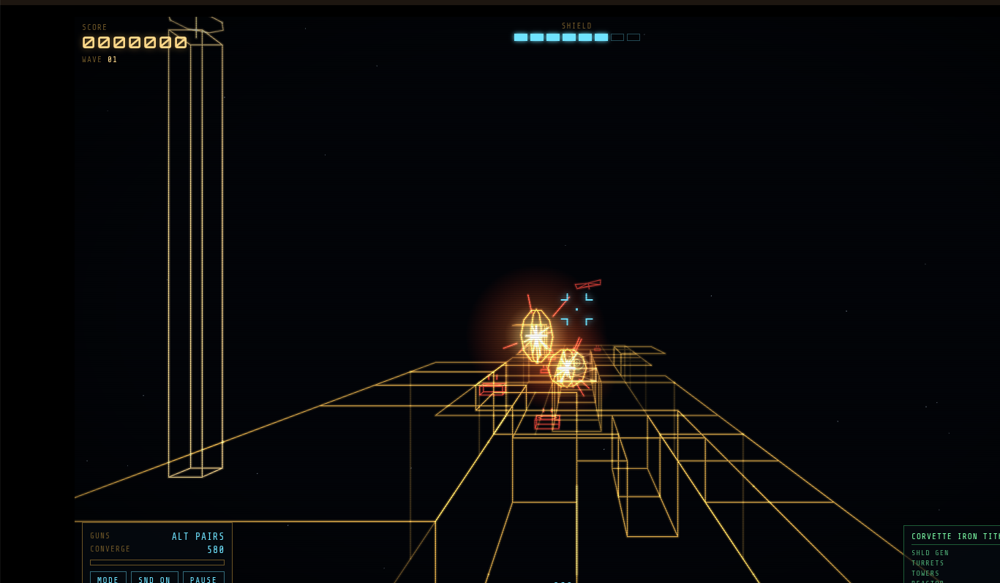
  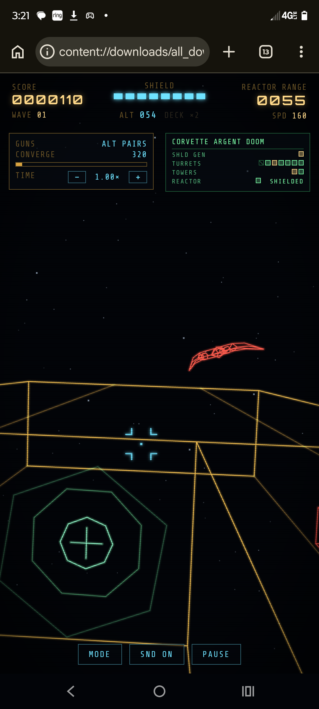
</p>

## Running locally

Open `index.html` in any current browser. Sound starts on the first click (LAUNCH), as browsers require.

For testing, `index.html?wave=N` starts the campaign at wave N (1–7). `?wave=7` goes straight to the starbase.

## Builds and feature switches

The top of the game script holds a `BUILD` version, a `CHANGELOG`, and `FEATURES` switches for balance options under test. The current build and live features are shown in the bottom-right corner (switched-off features are struck through), and the full changelog is under **BUILD** on the title card.

Any feature can be toggled from the URL for A/B play, and combined with `wave`:

```
index.html?wave=5&regen=0      wave 5 with shield regeneration off
index.html?burst=0&grow=0      no energy burst, flat 8 shields
```

## Project layout

```
index.html                     the game (single file)
docs/ENGINE.md                 reference design for building games in this style
docs/screenshots/              images used in these docs
tools/fighter_viewer.html      wireframe model viewer used to pick the enemy fighter design
tools/wave_start_audition.html sound audition page used to pick the wave-start sound
THIRD_PARTY_NOTICES.md         ZzFX license
```

## Building your own

[`docs/ENGINE.md`](docs/ENGINE.md) is a reference design for this engine: the camera and vector renderer, how hulls, models and collision are built, the combat and enemy systems, the progression ladder, the audio graph, how it was tested, and recipes for adding ship classes, hull types, enemies and sounds. It's written so you can use it to build a different game in the same style.

## Credits

Game design and direction: Scott Peterman. Built iteratively with Claude (Anthropic).

Sound synthesis core from [ZzFX](https://github.com/KilledByAPixel/ZzFX) by Frank Force, MIT License. See [`THIRD_PARTY_NOTICES.md`](THIRD_PARTY_NOTICES.md).

Inspired by Atari's *Star Wars* (1983). No assets, sounds or designs from that game are used.
