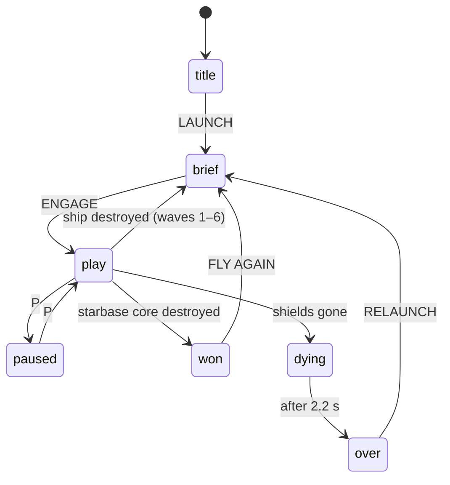
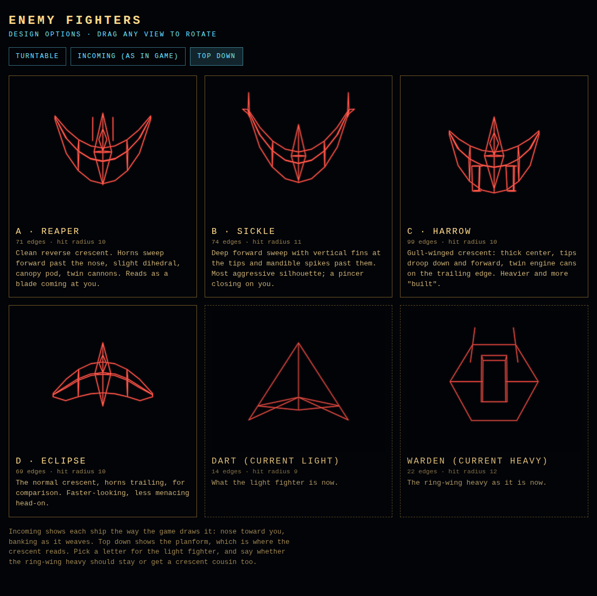
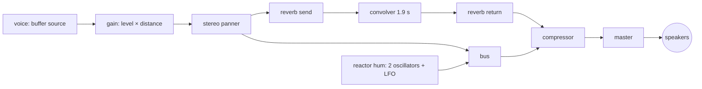

# DECKRUNNER engine — reference design

This document describes how DECKRUNNER is built, in enough detail to design a different game in the same style: a first-person, on-rails vector shooter drawn entirely with glowing lines on a 2D canvas, shipped as a single HTML file.

Code excerpts are copied verbatim from `index.html`. Section names in that file (`// ---- camera`, `// ---- line renderer` and so on) match the headings here.

## 1. Design goals and constraints

- **One self-contained file.** No build step, no dependencies, no runtime network. Libraries are inlined (the only one is the ZzFX synthesis core). It runs from `file://`, a static host, or a phone.
- **Look like a vector cabinet.** Every object is a set of 3D line segments. Brightness falls off with depth, lines add together where they cross, and a soft glow pass sits under a sharp core pass. There are no filled polygons and no textures.
- **Readable at speed.** Silhouettes, colors and HUD are chosen for instant recognition: brass hull, red enemies, cyan player fire, green shield systems, magenta exposed reactor.
- **Tunable by numbers.** Difficulty, ship layouts, sounds and fighter shapes live in tables and small builder calls, so changing the game is usually editing a value, not code.

## 2. Anatomy of the file

One `<canvas>` for the world, a DOM overlay for the HUD and cards, and one script wrapped in an IIFE. The script's sections, in order:

| Section | Responsibility |
|---|---|
| constants | world units, colors, brightness levels |
| camera | camera basis and world→camera transform |
| line renderer | `L3()` projection/clipping/bucketing, `flush()` drawing, primitive shapes |
| stars | background star sphere (rotation only, no translation) |
| fighter models | model format and the wing/pod/nacelle builders |
| ship generation | the difficulty ladder, the linear hull generator, `surfaceAt()` |
| starbase (boss) | polar hull, rotation, spoke alignment |
| state | `game` and player `P` objects, input state, entity arrays |
| audio | ZzFX core, sound bank, mixer graph, `sfx()` |
| messages / HUD | DOM text, target damage readout, throttled readouts |
| effects | bursts, debris, sparks |
| scoring / damage | damage, crashes, hits and kills |
| player | aim, steering, collision, firing |
| projectiles | player bolts, enemy plasma |
| enemies | fighter spawning and AI, turret fire |
| waves | wave start, briefings, ship death, coming around |
| drawing | hull, station, objects, actors, plasma bloom, reticle |
| attract / loop | title flyover, `update()`, `render()`, `frame()` |
| flow / input | launch, game over, victory, pause, time scale, event wiring |

## 3. The frame

`frame()` runs on `requestAnimationFrame`. It clamps the real frame time, then updates (unless paused) and renders.

```js
function frame(now) {
  let dt = (now - last) / 1000; last = now;
  if (dt > 0.05) dt = 0.05;
  if (game.state !== 'paused') update(dt);
  render();
  requestAnimationFrame(frame);
}
```

`update()` scales real time by the game-speed setting and dispatches on state. UI timers (banner messages) and keyboard aim run on real time; everything in the simulation runs on scaled time.

```js
function update(rdt) {
  const dt = rdt * game.ts;            // all simulation runs on scaled time
  game.time += dt;
  if (game.msgT > 0 && (game.msgT -= rdt) <= 0) $('msg').classList.remove('on');
  if (game.msg2T > 0 && (game.msg2T -= rdt) <= 0) $('msg2').classList.remove('on');
  if (game.state === 'title' || game.state === 'over' || game.state === 'won') { attract(dt); updateFx(dt); return; }
  if (game.state === 'brief') { briefFly(dt); updateFx(dt); updateHUD(); return; }
  if (game.state === 'dying') {
    game.dieT += dt;
    cam.z += game.speed*dt*Math.max(0, 1 - game.dieT);
    cam.roll += dt*2.2; cam.pitch -= dt*0.4;
    P.flash = Math.max(0, 1 - game.dieT*0.6);
    updateBolts(dt); updateEnemies(dt); updateFx(dt);
    if (game.dieT > 2.2) gameOver();
    return;
  }
  updateAim(rdt);
  updatePlayer(dt);
  updateBolts(dt);
  updateEnemies(dt);
  updateShip(dt);
  updateFx(dt);
  updateHUD();
}
```

`render()` always draws the same stack: clear, stars, hull or station, objects, actors, effects, then `flush()` puts all buffered lines on screen in one pass, then screen-space bloom sprites, the reticle, and a damage flash.

```js
function render() {
  updateBasis();
  ctx.fillStyle = '#020408';
  ctx.fillRect(0, 0, W, H);
  drawStars();
  if (ship) { if (ship.kind === 'disc') drawDisc(); else drawHull(); drawObjs(); }
  drawActors();
  drawFx();
  flush();
  drawGlows();
  if (game.state === 'play' || game.state === 'paused') drawReticle();
  if (P.flash > 0) {
    ctx.fillStyle = 'rgba(255,60,40,' + (P.flash*0.35).toFixed(3) + ')';
    ctx.fillRect(0, 0, W, H);
  }
}
```

### State machine



`title`, `over` and `won` run an attract-mode flyover behind the overlay card. `brief` slowly flies the camera toward the next target behind its briefing card.

## 4. World conventions

- **Axes:** `+x` right, `+y` up, `+z` forward. The player always flies toward `+z` at the wave's speed; lateral and vertical movement are steered.
- **Units:** one unit reads as one metre on the briefing cards. A hull segment is `SEG = 50`, a hull column is `CW = 20`.
- **Draw distance:** `FAR = 1500`. Beyond it nothing is drawn, and brightness reaches zero there, so there is no pop.
- **Near plane:** `NEAR = 2`, with proper line clipping (below), which lets geometry pass right beside and under the camera.
- **Models:** nose points `+z`, up is `+y`. Enemies are drawn with a yaw of π so they face the player.

## 5. Camera

The camera is a position plus yaw, pitch and roll, rebuilt into an orthonormal basis once per frame. Transforming a point is three dot products.

```js
function updateBasis() {
  const cy = Math.cos(cam.yaw), sy = Math.sin(cam.yaw), cp = Math.cos(cam.pitch), sp = Math.sin(cam.pitch);
  const f = [sy * cp, sp, cy * cp];
  const r0 = [cy, 0, -sy];
  const u0 = [f[1]*r0[2] - f[2]*r0[1], f[2]*r0[0] - f[0]*r0[2], f[0]*r0[1] - f[1]*r0[0]];
  const cr = Math.cos(cam.roll), sr = Math.sin(cam.roll);
  cam.r = [r0[0]*cr + u0[0]*sr, r0[1]*cr + u0[1]*sr, r0[2]*cr + u0[2]*sr];
  cam.u = [u0[0]*cr - r0[0]*sr, u0[1]*cr - r0[1]*sr, u0[2]*cr - r0[2]*sr];
  cam.f = f;
}
function toCam(x, y, z, o) {
  const dx = x - cam.x, dy = y - cam.y, dz = z - cam.z, r = cam.r, u = cam.u, f = cam.f;
  o[0] = dx*r[0] + dy*r[1] + dz*r[2];
  o[1] = dx*u[0] + dy*u[1] + dz*u[2];
  o[2] = dx*f[0] + dy*f[1] + dz*f[2];
  return o;
}
```

The player's lateral and vertical velocity drive small yaw, pitch and roll values (roll is about 3× the yaw gain), which is what gives the flight its banking feel without a real flight model.

## 6. The vector renderer

### L3: every line goes through one function

`L3()` takes a 3D segment, a color key and a brightness multiplier. It transforms both ends to camera space, clips the segment against the near plane instead of discarding it, rejects it if it's past `FAR` or entirely off screen, picks a brightness level from its midpoint depth, projects it, and pushes the four screen coordinates into a bucket for its color and level.

```js
function L3(x1, y1, z1, x2, y2, z2, col, br) {
  toCam(x1, y1, z1, A); toCam(x2, y2, z2, B);
  let az = A[2], bz = B[2];
  if (az < NEAR && bz < NEAR) return;
  let ax = A[0], ay = A[1], bx = B[0], by = B[1];
  if (az < NEAR) { const t = (NEAR - az) / (bz - az); ax += (bx - ax)*t; ay += (by - ay)*t; az = NEAR; }
  else if (bz < NEAR) { const t = (NEAR - bz) / (az - bz); bx += (ax - bx)*t; by += (ay - by)*t; bz = NEAR; }
  const mz = (az + bz) * 0.5;
  if (mz >= FAR) return;
  const d = 1 - mz / FAR;
  const b = d * Math.sqrt(d) * (br === undefined ? 1 : br);
  if (b < 0.05) return;
  const lv = b >= 1 ? LEVELS - 1 : Math.floor(b * LEVELS);
  const hw = W * 0.5, hh = H * 0.5;
  const sx1 = hw + ax / az * F, sy1 = hh - ay / az * F, sx2 = hw + bx / bz * F, sy2 = hh - by / bz * F;
  if ((sx1 < -60 && sx2 < -60) || (sx1 > W + 60 && sx2 > W + 60) ||
      (sy1 < -60 && sy2 < -60) || (sy1 > H + 60 && sy2 > H + 60)) return;
  buckets[CIDX[col]][lv].push(sx1, sy1, sx2, sy2);
}
```

The brightness curve is `d·√d` where `d = 1 − depth/FAR`. It keeps nearby lines bright, fades distance smoothly, and makes the far hull recede instead of cluttering the view. The `br` argument lets callers dim secondary lines (deck seams at 0.3–0.45) or overdrive hot ones (explosions and plasma above 1, clamped to the top level).

### Buckets and flush

Lines are never stroked individually. They are grouped into `colors × LEVELS` buckets (7 levels), and `flush()` draws each bucket as one path twice with additive blending: a wide, faint glow pass and a thin, bright core pass.

```js
function flush() {
  ctx.globalCompositeOperation = 'lighter';
  ctx.lineCap = 'round';
  for (let ci = 0; ci < CKEYS.length; ci++) {
    ctx.strokeStyle = COLORS[CKEYS[ci]];
    for (let lv = 0; lv < LEVELS; lv++) {
      const a = buckets[ci][lv];
      if (!a.length) continue;
      ctx.beginPath();
      for (let i = 0; i < a.length; i += 4) { ctx.moveTo(a[i], a[i+1]); ctx.lineTo(a[i+2], a[i+3]); }
      const al = (lv + 1) / LEVELS;
      if (glow) { ctx.globalAlpha = al * 0.2; ctx.lineWidth = 4.5; ctx.stroke(); }
      ctx.globalAlpha = al; ctx.lineWidth = 1.25; ctx.stroke();
      a.length = 0;
    }
  }
  ctx.globalAlpha = 1;
  ctx.globalCompositeOperation = 'source-over';
}
```

This is the heart of the look and of the performance. With 10 colors and 7 levels there are at most 70 paths per frame (140 strokes with glow on) no matter how many lines there are, crossings brighten naturally because of `lighter`, and glow can be turned off (G) to halve the stroke cost on weak devices. `devicePixelRatio` is capped at 2.

### Bloom sprites

Additive lines can't make something look white-hot. Enemy plasma bolts also push a screen-space radial gradient (`drawGlows()`), sized by distance and drawn after `flush()`. Use this sparingly, for the few things that should look incandescent.

### Primitives

| Function | Draws |
|---|---|
| `box(x0,y0,z0,x1,y1,z1,c,br)` | axis-aligned box, 12 edges |
| `hring(x,y,z,r,n,c,br,rot)` | horizontal ring (n segments), optional rotation |
| `vring(x,y,z,r,n,c,br,rot)` | vertical ring facing −z |
| `fring(x,y,z,r,n,c,br,rot,face)` | vertical ring facing any heading (rotating ports) |
| `dome(x,y,z,R,c,br)` | hemisphere: 3 latitude rings, 8 meridians |
| `drawModel(m,x,y,z,yaw,roll,scale,c,br)` | a wireframe model (below) |
| `DL(u1,v1,y1,u2,v2,y2,c,br)` | a line in the starbase's rotating local frame |
| `arc(r,y,c,br,skip)` | a station ring, optionally broken where trenches cut it |

## 7. Wireframe models

A model is `{ v: [[x,y,z], …], e: [[i,j], …] }`: vertices and index pairs. `drawModel()` applies roll, then yaw, then scale and translation, and calls `L3()` for each edge.

Models are built from small builders rather than typed by hand:

```js
function wing(m, o) {
  const N = o.n || 9, prev = [];
  for (let i = 0; i < N; i++) {
    const s = -1 + 2 * i / (N - 1), as = Math.abs(s);
    const x = o.span * s;
    const zL = o.z + o.sweep * s * s;
    const ch = o.chord * Math.pow(Math.max(0, 1 - s * s), 0.55) + o.tip;
    const zT = zL - ch, zm = zL - ch * 0.38;
    const y = (o.dih || 0) * as - (o.gull || 0) * Math.pow(Math.max(0, as - 0.5) * 2, 2);
    const t = (o.thick || 1) * Math.sqrt(Math.max(0, 1 - s * s)) + 0.12;
    const ring = (i === 0 || i === N - 1 || i % 2 === 0) ? [[0,1],[1,2],[2,3],[3,0]] : [];
    const b = add(m, [[x, y, zL], [x, y + t, zm], [x, y, zT], [x, y - t * 0.55, zm]], ring);
    if (prev.length) for (let k = 0; k < 4; k++) m.e.push([prev[prev.length - 1] + k, b + k]);
    prev.push(b);
  }
  return prev;
}
```

`wing()` lofts a crescent wing. Each span station has a lens-shaped cross-section (leading edge, upper surface, trailing edge, lower surface), and the stations are joined lengthwise. `sweep > 0` puts the tips forward (a reverse crescent), `gull` droops the outer wing, `dih` adds dihedral. `pod()` is a faceted fuselage with an optional canopy, and `nacelle()` is a small hexagonal engine can. The light fighter is five calls:

```js
const HARROW = (() => {     // light fighter: gull-winged reverse crescent (design C from the viewer)
  const m = mk();
  wing(m, { span: 12, z: 0, sweep: 6, chord: 9, tip: 1, thick: 1.8, dih: 0.4, gull: 3 });
  pod(m, { zf: 9, zb: -9, zm: -1, w: 2.4, h: 2.2, canopy: true });
  nacelle(m, -4.2, 0.2, -3.5, -9.5, 1.3);
  nacelle(m, 4.2, 0.2, -3.5, -9.5, 1.3);
  return m;
})();
```

### Readability rules learned the hard way

- **Design for the angle the player actually sees.** Fighters mostly approach nose-on and slightly above. A flat crescent collapses to a line head-on; the Harrow reads because its gull droop and engine cans have depth. Check every model head-on before you commit.
- **60–100 edges** is the sweet spot for a hero enemy. Under 20 looks like folded paper; much more turns into noise at distance.
- **Rigid parts only.** Vector enemies read through silhouette and motion, not deformation. Bank and weave them; don't animate their shapes.
- **Build a viewer.** `tools/fighter_viewer.html` renders candidates in turntable, incoming and top-down views with the game's line style. Choosing from it took one round instead of several.

<p align="center"></p>

## 8. Level geometry

### One contract: `surfaceAt(x, z)`

Every hull type answers a single question: *how high is the hull surface at this point?* (`-1e9` means empty space.) That one function drives player collision, bolt impacts, fighter floor clearance, the altitude readout and the deck-hugging score multiplier.

```js
function surfaceAt(x, z) {
  if (!ship) return -1e9;
  if (ship.kind === 'disc') {
    const pz = ship.zc - z;
    return discLocal(ship, pz*ship.rc + x*ship.rs, x*ship.rc - pz*ship.rs);
  }
  const s = Math.floor(z / SEG);
  if (s < 0 || s >= ship.segs) return -1e9;
  const c = Math.floor((x + HW) / CW);
  if (c < 0 || c >= COLS) return -1e9;
  return ship.h[s][c];
}
```

Keep this contract and any hull shape you can describe as a height field works with the rest of the engine unchanged.

### Linear hulls (waves 1–6)

A linear ship is a grid: `segs` segments along `z` by `COLS` columns across `x`, each cell holding a height. `genShip()` stamps features into it:

1. superstructure blocks (raised rectangles),
2. one or two side trenches (−30),
3. hangar blocks (+40) with the two segments in front flattened so the bay mouth is visible,
4. the main trench (the center two columns at −40) running to an end wall, with the reactor port on that wall,
5. shield generator domes on verified flat 3×3 patches,
6. turrets, towers and catwalks placed on whatever the heightmap offers.

`drawHull()` draws longitudinal edges only where adjacent columns differ, plus dim seams every third column, and draws cross-section profiles only where a segment differs from the previous one (with a dim rib every fourth). That keeps the line count proportional to the detail, not the ship's size.

### The rotating starbase (wave 7)

The starbase is a disc defined in its own local frame (`lu` along the approach axis, `lv` across it) and rotated by `ship.rot` every frame. `discLocal()` answers the height question in local coordinates, and `surfaceAt()` rotates world coordinates into that frame first. Features are rules on radius and spoke distance: trench if within 20 of a spoke line and outside the hub, otherwise spire, hub, rim wall, habitat ring, blocks, or deck.

```js
function discLocal(S, lu, lv) {
  const r = Math.hypot(lu, lv);
  if (r > ST.R) return -1e9;
  for (let k = 0; k < 3; k++) {
    const ca = SPC[k][0], sa = SPC[k][1], su = lu*ca + lv*sa, sv = -lu*sa + lv*ca;
    if (su > ST.RHUB && sv < ST.TW && sv > -ST.TW) return -40;
  }
  if (r < ST.RSPIRE) return 120;
  if (r < ST.RHUB) return 35;
  if (r > ST.R - ST.RIMW) return 25;
  if (r > ST.HAB0 && r < ST.HAB1) return 22;
  for (const b of S.blocks) if (Math.abs(lu - b.u) < b.hu && Math.abs(lv - b.v) < b.hv) return b.h;
  return 0;
}
```

Objects on the station store local coordinates, and `syncDisc()` recomputes their world positions each frame, so everything rotates together. `alignSpoke(k)` solves for the rotation that lines spoke `k` up with the player's approach at the moment they cross the rim. That turns "wait for the trench to come around" into "each pass is a different trench," which is much better on rails.

## 9. Targets, hits and kills

Every destructible thing is a plain object with a common shape:

```js
{ type, x, y, z, r, hp, max, alive, pts, el }
```

`type` selects drawing and kill behavior, `r` is the hit radius, and `el` is the object's box in the damage readout, if any. Extras by type: turrets have `by` (base height) and `fireT`; towers have `top` and are hit-tested as vertical capsules; reactor ports on the starbase have `core`, a shared hit-point pool, so hitting any port damages the one core.

Player bolts are tested as swept segments (previous position to current) against each target's center with `segPointDist2()`, so fast bolts can't tunnel through small targets. A bolt that dips below `surfaceAt()` hits the hull instead, which is why the reactor has to be shot from inside its trench.

Entity arrays (bolts, enemy plasma, fighters, effects) use an `alive` flag and are compacted in place once per update with `compact()`, avoiding per-frame allocation churn.

## 10. The player

- **Steering:** the reticle position relative to screen center sets the target lateral and vertical velocity, with a 5% dead zone, eased at 4/s. Aim and steer are the same gesture, as on the yoke cabinet.
- **Collision:** lateral moves into a taller cell are rejected (a scrape, with damage if fast). Ending a step below the surface is a crash: damage, then the ship pops up above it. Catwalks and towers have their own crossing checks.
- **Guns:** four gun ports offset in camera space. Each bolt aims at the point `conv` units along the reticle ray, plus the ship's forward speed, so in the ship's frame all four lines converge exactly at the convergence range. ALT fires alternating pairs quickly; LINK fires all four at 1.5× damage per bolt, more slowly. Every shot adds heat; overheating locks the guns until heat falls below 35.
- **Scoring:** within 22 of the surface, kill points double.

## 11. Enemies

- **Turrets** fire when the player is 150–680 ahead. Shots lead the target with a closing-speed estimate plus a few units of random jitter, so dodging works and flying straight doesn't.
- **Fighters** are a two-state machine. `in`: close on the player while weaving on sine offsets, firing between 130 and 620 range. `out`: break past the player and climb. After a pass they return from far ahead; after two passes they leave. Bank follows lateral velocity. Fighters never fly below 14 above the hull.
- **Spawning:** from a live hangar or bay ahead of the player (with a launch sound), otherwise from far ahead during the approach, capped per wave by `fcap`.
- **Enemy plasma** is itself a target (`r = 5`), so it can be shot down.

## 12. Progression

Difficulty is one table. Each row is a ship class; `waveCfg(n)` returns row `n`.

| Field | Meaning |
|---|---|
| `cls` | class name shown on the briefing |
| `kind` | `'disc'` for the starbase; linear otherwise |
| `cols`, `segs`, `trench` | beam (columns), length (segments), trench length |
| `gens`, `hangars` | shield generators, launch bays |
| `fcap`, `heavy` | fighters at once, share of heavy fighters |
| `turDiv`, `towDiv`, `catGap` | turret and tower density divisors, catwalk spacing |
| `speed`, `fireMul`, `boltSpd`, `spawn` | forward speed, enemy fire rate, plasma speed, spawn interval |
| `tip` | the briefing's one-line advice |

Each row introduces one new idea: generators, then catwalks, then a launch bay, then heavies, then two bays, then density, then the starbase. The briefing card shows the numbers before the player commits, so a harder wave feels like information rather than a surprise.

## 13. HUD

The HUD is DOM, not canvas: crisp text at any DPR, CSS layout (including a separate portrait layout), and no redraw cost. Two rules keep it cheap and legible:

- `setText()` only touches the DOM when a value actually changes.
- Fast-changing readouts are throttled and quantized. The reactor range refreshes about 8 times a second in 5 m steps. It also locks to one target per pass: choosing the nearest of several ports made the number jump between them.

The target damage readout is built per ship from its generators, bays, turrets, towers and reactor ports, one box each. Boxes turn amber when damaged and dark when destroyed.

In portrait on phones, the instruments move into the upper third (the sky, which is empty) and only a thin button strip stays at the bottom, where the deck and trench are.

## 14. Time scale

`game.ts` (0.05–1.0) multiplies simulation `dt`. Because every animation reads `dt` or `game.time`, slowing time needs no special cases. Real time is kept for UI timers and keyboard aim, so slow motion never makes the controls feel sluggish. Audio playback rate is scaled by `0.55 + 0.45·ts`, a gentle bullet-time pitch drop.

## 15. Audio

### Synthesis

Sounds are ZzFX parameter arrays rendered once, when the player presses LAUNCH (which also satisfies browser autoplay rules), into `AudioBuffer`s. The ZzFX `buildSamples` routine is inlined as `zzfxBuild(sampleRate, ...params)` with its MIT notice. Randomness is set to 0 at build time; variation comes from playback-rate jitter at play time.

```js
const SFX = {
  laser:    { p:[1,0,1400,0,.03,.12,2,1.3,-14,0,0,0,0,0,0,0,0,1,0,0,-7500],           vol:.34, max:8, jit:.07, rev:.10 },
  laserH:   { p:[1,0,760,.005,.05,.2,2,1.6,-4,0,0,0,0,.15,0,.08,0,1,0,0,-5000],        vol:.50, max:4, jit:.05, rev:.18 },
  plasma:   { p:[1,0,300,.01,.06,.22,1,1,-.8,0,0,0,0,.35,14,0,0,1,0,0,-3500],        vol:.34, max:6, jit:.12, rev:.15 },
  whoosh:   { p:[1,0,180,.06,.05,.22,4,1,6,0,0,0,0,1,0,0,0,1,0,0,-2200],             vol:.30, max:3, jit:.15, rev:.10 },
  flyby:    { p:[1,0,420,.12,.1,.35,4,1,-1,0,0,0,0,1,0,0,0,1,0,0,-3000],             vol:.34, max:3, jit:.10, rev:.15 },
  launch:   { p:[1,0,140,.08,.15,.2,2,1,1.5,0,0,0,0,.3,0,.1,0,1,0,0,-1800],          vol:.40, max:3, jit:.08, rev:.25 },
  boomS:    { p:[1,0,95,0,.04,.45,4,1,-.1,0,0,0,0,.8,0,.2,0,.8,.05,0,-2600],         vol:.80, max:8, jit:.12, rev:.30 },
  boomM:    { p:[1,0,70,0,.12,.9,4,1,-.05,0,0,0,0,.9,0,.25,.07,.7,.1,0,-1900],       vol:.90, max:5, jit:.10, rev:.45 },
  boomL:    { p:[1,0,48,0,.35,2.2,4,1,-.3,0,0,0,.09,1,0,.3,.14,.75,.2,.35,-1400],    vol:1.0, max:3, jit:.06, rev:.60 },
  sub:      { p:[1,0,120,0,.05,.6,0,1,-.25,0,0,0,0,0,0,0,0,1,0,0,0],                 vol:.80, max:6, jit:.05, rev:0   },
  hit:      { p:[1,0,180,0,.04,.28,2,1,-.4,0,0,0,0,.6,0,.45,0,1,0,0,-2500],          vol:.70, max:3, jit:.08, rev:.12 },
  deflect:  { p:[1,0,1900,0,.01,.28,0,1,0,0,0,0,0,0,55,0,.05,1,0,0,0],               vol:.28, max:3, jit:.06, rev:.35 },
  overheat: { p:[1,0,240,0,.3,.25,5,1,-.2,0,0,0,.05,0,0,.3,0,1,0,.6,0],              vol:.34, max:1, jit:.02, rev:.10 },
  chime:    { p:[1,0,660,.005,.08,.35,1,1,0,0,330,.09,0,0,0,0,.08,1,0,0,0],          vol:.34, max:6, jit:0,   rev:.40 },
  hyper:    { p:[1,0,900,.02,.25,.4,4,1,-1.2,0,0,0,0,1,0,0,0,1,0,0,-2600],       vol:.45, max:1, jit:.04, rev:.35 },
  alarm:    { p:[1,0,880,0,.06,.03,5,1,0,0,0,0,0,0,0,0,0,1,0,0,-4000],               vol:.20, max:2, jit:0,   rev:.05 },
};
```

### Mixer graph



```js
function sfx(key, o) {
  if (!AC || !sndOn) return;
  const d = SFX[key];
  if (!d || !d.buf || voices[key] >= d.max) return;
  o = o || {};
  let vol = d.vol * (o.vol != null ? o.vol : 1), pan = o.pan || 0;
  if (o.x !== undefined) {
    toCam(o.x, o.y, o.z, SA);
    const dist = Math.hypot(SA[0], SA[1], SA[2]);
    vol *= 1 / (1 + dist / 450);
    pan = clamp(SA[0] / (Math.abs(SA[2]) + 60), -1, 1) * 0.85;
    if (vol < 0.015) return;
  }
  const src = AC.createBufferSource();
  src.buffer = d.buf;
  const slow = 0.55 + 0.45 * game.ts;      // slow motion pitches everything down a little
  src.playbackRate.value = (o.rate || 1) * slow * (1 + (Math.random()*2 - 1) * d.jit);
  const g = AC.createGain(); g.gain.value = vol;
  src.connect(g);
  let out = g;
  if (AC.createStereoPanner) { const pn = AC.createStereoPanner(); pn.pan.value = pan; g.connect(pn); out = pn; }
  out.connect(busIn);
  if (d.rev) { const sg = AC.createGain(); sg.gain.value = d.rev; out.connect(sg); sg.connect(revIn); }
  voices[key]++;
  src.onended = () => { voices[key]--; };
  src.start(AC.currentTime + (o.when || 0));
}
```

- **Spatial:** sounds given a world position are panned by their camera-space `x` and attenuated with `1/(1 + distance/450)`.
- **Voice caps** per sound stop rapid fire from becoming a buzz and bound CPU use.
- **Compressor** on the master keeps big moments punchy instead of clipping.
- **Reverb** comes from a synthetic stereo impulse (decaying noise), sent per sound: lasers a little, explosions a lot.
- **Continuous sounds** (the reactor hum) use native oscillators rather than ZzFX, so they can loop and swell smoothly. They're driven from the HUD update.

### ZzFX tuning gotchas

- **Slide can overshoot zero.** `slide` changes frequency by about `slide × 500` Hz per second. If the sound outlasts `frequency / (slide × 500)` seconds, the pitch passes through zero and rises again. Check the duration.
- **Short `delay` values comb-filter.** An echo of a few tens of milliseconds on a pitched sweep produces fizz. Use the reverb send for space instead.
- **A saw with noise, low-pass filtered around 1–2 kHz, can sound vocal.** That was the "almost human" wave-start sound.
- **Audition before wiring in.** `tools/wave_start_audition.html` plays candidates through the same mixer. Rendering buffers offline and tracing pitch and energy by zero crossings catches the objective problems; your ears handle the rest.

## 16. Testing approach

- **Node harness.** The game script is extracted from the HTML and run in Node with stubs for `document`, `window`, the canvas context and `AudioContext`, driven by a fake `requestAnimationFrame` clock and scripted input. This runs thousands of frames: generation sweeps (hundreds of ships per wave, checking generator placement and counts), autopilot trench runs through all seven waves, the victory path, and that every sound fires.
- **Headless browser renders.** Chromium via Playwright loads the real file at phone and desktop sizes, clicks through the flow, captures screenshots and fails on any page error. This caught layout overlaps, a dead briefing camera and a frozen viewer before a player saw them.
- **`?wave=N`** starts at any wave for manual checks, and the time-scale control makes visual inspection easy.

## 17. Recipes

**Add a ship class.** Add a row to `LADDER` (the fields above). If it only varies numbers, you're done: the generator, briefing and damage readout adapt. Change the victory condition in `updateShip()` if it becomes the new final wave.

**Add a hull type.** Write a generator returning `{ kind, objs, gens, turrets, towers, hangars, reactor, len, farSpawnZ, … }`, add a `kind` branch to `surfaceAt()` and a draw function in `render()`, and give its reactor objects `type: 'rx'`. Everything else — combat, AI, HUD, audio — works off the shared object shape and `surfaceAt()`.

**Add an enemy model.** Build it with `mk()`, `wing()`, `pod()` and `nacelle()` (or hand-author `v`/`e`), check it in the viewer head-on, then reference it in `spawnFighter()`. Set `r` a bit under the drawn half-span: the Harrow spans about ±14 at the draw scale of 1.2 and uses `r = 10`, so glancing shots at the wingtips miss.

**Add a target type.** Give it the common target shape and a new `type`, add a `case` in `drawObjs()` and in `kill()`, and a box row in `buildSSD()` if it belongs on the damage readout.

**Add a sound.** Add an `SFX` entry (parameters, `vol`, `max`, `jit`, `rev`) and call `sfx('name', { x, y, z })` at the event.

**Adapt to a different game.** The reusable core is the camera, `L3()`/`flush()`, the primitives, the model builders, the `surfaceAt()` contract, the target shape with swept hit tests, the time scale, and the audio graph. A tunnel shooter, a canyon run or a rail tank game can keep all of that and replace the ship generators, the player steering model and the ladder.

## 18. Lessons

- Put the look in one place. Routing every line through `L3()` and `flush()` let depth, glow and performance be tuned globally.
- One geometric contract (`surfaceAt`) kept every system working when an entirely different hull shape arrived.
- Tables beat code for balance, progression and sound. Change a number, not a branch.
- Build small tools to decide: a model viewer and a sound audition page each replaced several rounds of trial and error.
- Throttle and anchor what players read. Correct values that change every frame are still unreadable.
- Test the angle players actually see, the moment they hear, and the device they actually hold.
